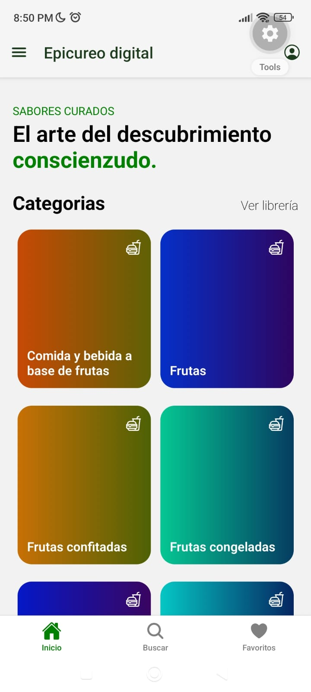
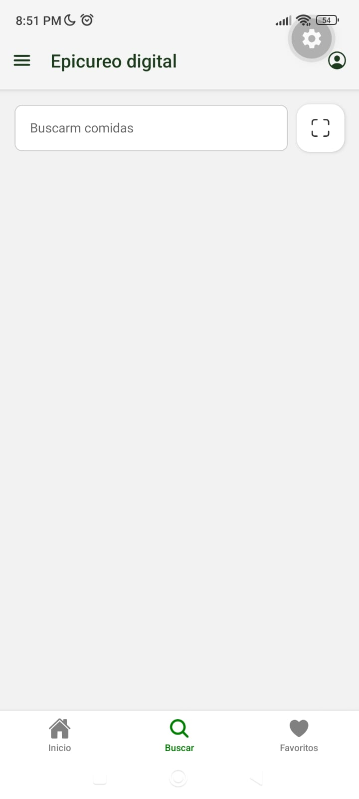
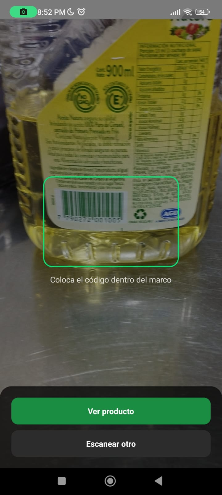
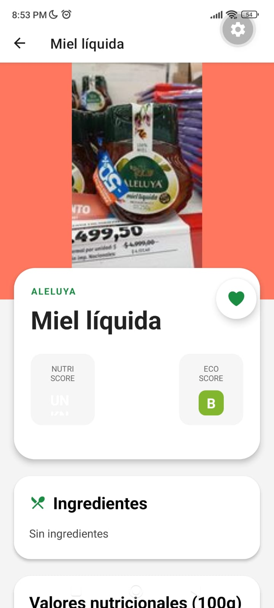
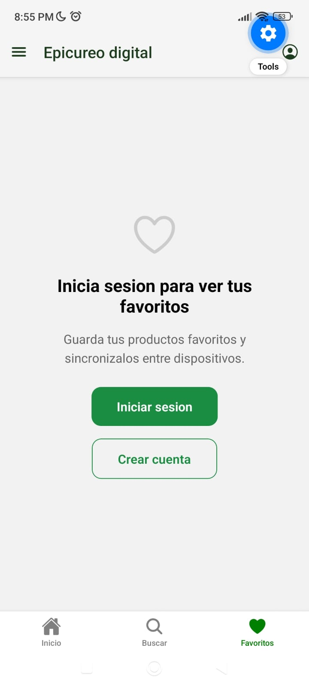
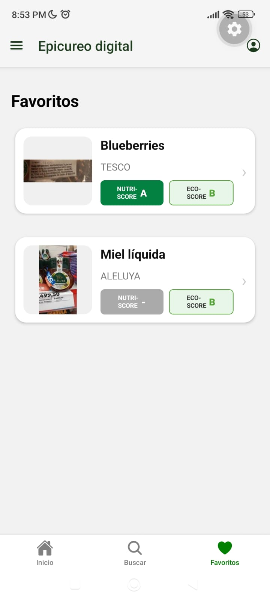

# TNT Alimentos

## 1. Resumen del proyecto

**TNT Alimentos** es una aplicación móvil para búsqueda y consulta de productos alimenticios. Permite escanear códigos de barras, consultar información nutricional detallada (NutriScore, EcoScore) y guardar productos favoritos sincronizados en tiempo real entre dispositivos.

### Funcionalidades principales

- **Búsqueda de productos**: Por nombre, categoría, marca o etiqueta
- **Escaneo de códigos de barras**: Usa la cámara del dispositivo para identificar productos
- **Ficha detallada**: Información nutricional completa con NutriScore, EcoScore y componentes
- **Sistema de favoritos**: Guarda productos favoritos con sincronización en tiempo real
- **Autenticación de usuarios**: Login y registro con email/contraseña

### Tecnologías utilizadas

| Tecnología                 | Versión | Uso                           |
| -------------------------- | ------- | ----------------------------- |
| Expo SDK                   | 55      | Framework de desarrollo       |
| React Native               | 0.83    | Interface de usuario          |
| Expo Router                | 55      | Navegación basada en archivos |
| Firebase Authentication    | 12.15   | Autenticación de usuarios     |
| Firebase Realtime Database | 12.15   | Sincronización en tiempo real |
| React Query                | 5.100   | Gestión de estado asíncrono   |
| TypeScript                 | 5.9     | Tipado estático               |

### Capturas de pantalla






---

## 2. Autenticación

### Tecnología elegida: Firebase Authentication

Firebase Authentication proporciona una solución completa para autenticar usuarios. Se utilizó el método de **email/contraseña** por su simplicidad y compatibilidad nativa con Firebase.

### Cómo se integró

1. Se instaló el SDK de Firebase: `npm install firebase`
2. Se creó un proyecto en Firebase Console
3. Se habilitó el método de autenticación email/contraseña
4. Se configuró `src/services/auth/firebase.ts` con los datos del proyecto
5. Se implementó `AuthProvider` que maneja el estado de autenticación
6. Se crearon pantallas de login y registro en `app/(auth)/`

### Persistencia de sesión

Se utilizó `initializeAuth` con `getReactNativePersistence(AsyncStorage)` para que la sesión se mantenga entre cierres de la aplicación:

```typescript
import { initializeAuth, getReactNativePersistence } from "firebase/auth";
import ReactNativeAsyncStorage from "@react-native-async-storage/async-storage";

export const auth = initializeAuth(app, {
  persistence: getReactNativePersistence(ReactNativeAsyncStorage),
});
```

### Estructura de archivos

```
src/
  context/AuthProvider.tsx    ← Contexto de autenticación
  services/auth/
    firebase.ts               ← Configuración de Firebase
    auth.ts                   ← Funciones de login/signup/logout
app/(auth)/
  login.tsx                   ← Pantalla de inicio de sesión
  signup.tsx                  ← Pantalla de registro
```

### Capturas de pantalla



---

## 3. Tiempo real / sincronización

### Tecnología elegida: Firebase Realtime Database

Firebase Realtime Database permite sincronizar datos en tiempo real entre dispositivos. Se utilizó para mantener los favoritos del usuario sincronizados automáticamente.

### Cómo se integró

1. Se creó la base de datos en Firebase Console
2. Se configuraron las reglas de seguridad para acceso por usuario
3. Se implementaron funciones de lectura/escritura en `src/services/accessors/favorites.ts`
4. Se crearon hooks con listeners `onValue` para actualizaciones en tiempo real

### Estructura de datos

```
/users/
  └── {uid}/
       └── favorites/
            └── {foodCode}
                 ├── code: "20150907"
                 ├── product_name: "..."
                 ├── brands: "..."
                 └── image_front_small_url: "..."
```

### Flujo de datos

```
┌─────────────────┐     ┌──────────────────┐     ┌─────────────────┐
│  Dispositivo A  │────▶│  Firebase RTDB   │◀────│  Dispositivo B  │
│  (lista favs)   │     │  /users/{uid}/   │     │  (ficha producto)│
│                 │◀────│    favorites/    │────▶│                 │
└─────────────────┘     └──────────────────┘     └─────────────────┘
        │                        │                        │
        │    onValue listener    │    onValue listener    │
        └────────────────────────┴────────────────────────┘
                     Actualización automática
```

### Reglas de seguridad

```json
{
  "rules": {
    "users": {
      "$uid": {
        ".read": "auth !== null && auth.uid === $uid",
        ".write": "auth !== null && auth.uid === $uid",
        "favorites": {
          "$foodCode": {
            ".read": "auth !== null && auth.uid === $uid",
            ".write": "auth !== null && auth.uid === $uid"
          }
        }
      }
    }
  }
}
```

### Hooks implementados

- `useFavoritos()` — Suscribe a la lista completa de favoritos con `onValue`
- `useFavorito(food)` — Suscribe al estado de un favorito individual

### Capturas de pantalla



---

## 4. Puesta en marcha

### Requisitos previos

- **Node.js** versión 18 o superior
- **npm** (incluido con Node.js)
- **Expo CLI**: `npm install -g expo-cli`
- **Cuenta de Firebase** (gratuita en console.firebase.google.com)
- **Expo Go** instalado en el celular (para probar en dispositivo)

### Pasos para configurar

#### 1. Clonar el repositorio

```bash
git clone <url-del-repositorio>
cd tnt-alimentos
```

#### 2. Instalar dependencias

```bash
npm install
```

#### 3. Configurar Firebase

##### a. Crear proyecto en Firebase

1. Ir a https://console.firebase.google.com
2. Click en "Crear proyecto"
3. Nombre: `tnt-alimentos`
4. Desactivar Google Analytics (opcional)
5. Click en "Crear proyecto"

##### b. Habilitar Authentication

1. En el menú lateral, ir a "Authentication"
2. Click en "Comenzar"
3. Pestaña "Método de inicio de sesión"
4. Habilitar "Correo electrónico/Contraseña"
5. Click en "Guardar"

##### c. Crear Realtime Database

1. En el menú lateral, ir a "Realtime Database"
2. Click en "Crear base de datos"
3. Seleccionar ubicación (usar la recomendada)
4. Elegir "Iniciar en modo de prueba"
5. Click en "Aceptar"

##### d. Configurar reglas de seguridad

1. En Realtime Database, ir a pestaña "Reglas"
2. Reemplazar el contenido con:

```json
{
  "rules": {
    "users": {
      "$uid": {
        ".read": "auth !== null && auth.uid === $uid",
        ".write": "auth !== null && auth.uid === $uid",
        "favorites": {
          "$foodCode": {
            ".read": "auth !== null && auth.uid === $uid",
            ".write": "auth !== null && auth.uid === $uid"
          }
        }
      }
    }
  }
}
```

3. Click en "Publicar"

##### e. Obtener configuración

1. Ir a "Configuración del proyecto" (icono de engranaje)
2. Pestaña "General"
3. Sección "Tus apps" → Click en icono web `</>`
4. Nombre de la app: `tnt-alimentos`
5. Click en "Registrar app"
6. Copiar el objeto de configuración

##### f. Actualizar configuración en el código

1. Abrir `src/services/auth/firebase.ts`
2. Reemplazar el objeto `firebaseConfig` con los datos copiados:

```typescript
const firebaseConfig = {
  apiKey: "TU_API_KEY",
  authDomain: "TU_PROYECTO.firebaseapp.com",
  databaseURL: "https://TU_PROYECTO-default-rtdb.firebaseio.com/",
  projectId: "TU_PROYECTO",
  storageBucket: "TU_PROYECTO.firebasestorage.app",
  messagingSenderId: "TU_SENDER_ID",
  appId: "TU_APP_ID",
};
```

#### 4. Iniciar la aplicación

```bash
npx expo start
```

#### 5. Probar en dispositivo

1. Abrir Expo Go en el celular
2. Escanear el código QR que aparece en la terminal
3. La app debería cargar y funcionar

### Estructura del proyecto

```
tnt-alimentos/
├── app/
│   ├── (auth)/
│   │   ├── login.tsx        ← Pantalla de login
│   │   └── signup.tsx       ← Pantalla de registro
│   ├── (tabs)/
│   │   ├── index.tsx        ← Inicio
│   │   ├── search.tsx       ← Búsqueda
│   │   └── favs.tsx         ← Favoritos
│   ├── foods/[id].tsx       ← Ficha de producto
│   └── _layout.tsx          ← Layout principal
├── src/
│   ├── components/          ← Componentes reutilizables
│   ├── context/             ← Contextos (AuthProvider)
│   ├── hooks/               ← Custom hooks
│   ├── models/              ← Modelos de datos
│   ├── services/            ← Servicios (Firebase, API)
│   └── navigation/          ← Rutas
└── package.json
```

### Solución de problemas

| Problema                  | Solución                                    |
| ------------------------- | ------------------------------------------- |
| Error "permission_denied" | Verificar reglas de Firebase RTDB           |
| Login no persiste         | Verificar `initializeAuth` con AsyncStorage |
| App no carga              | Ejecutar `npm install` nuevamente           |
| Errores de TypeScript     | Ejecutar `npx tsc --noEmit`                 |
